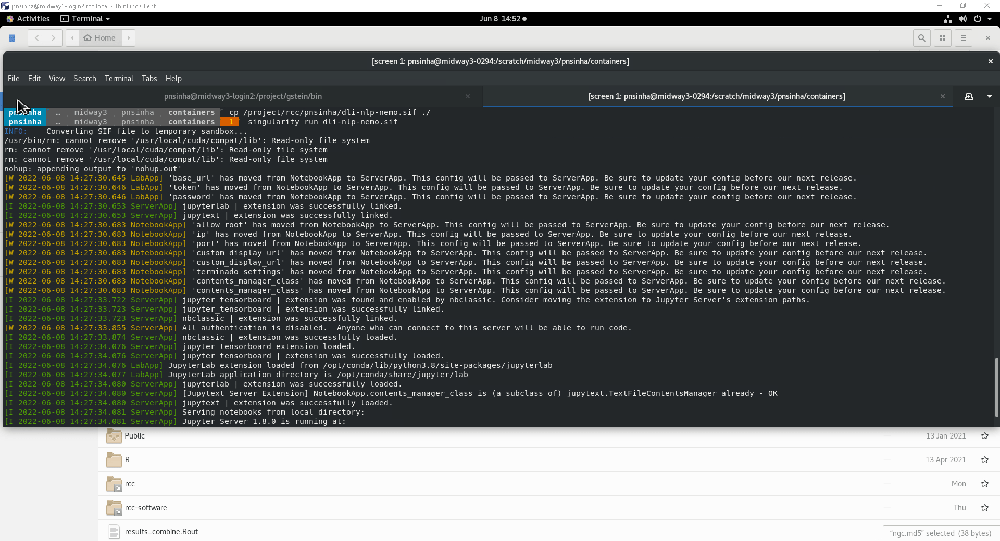
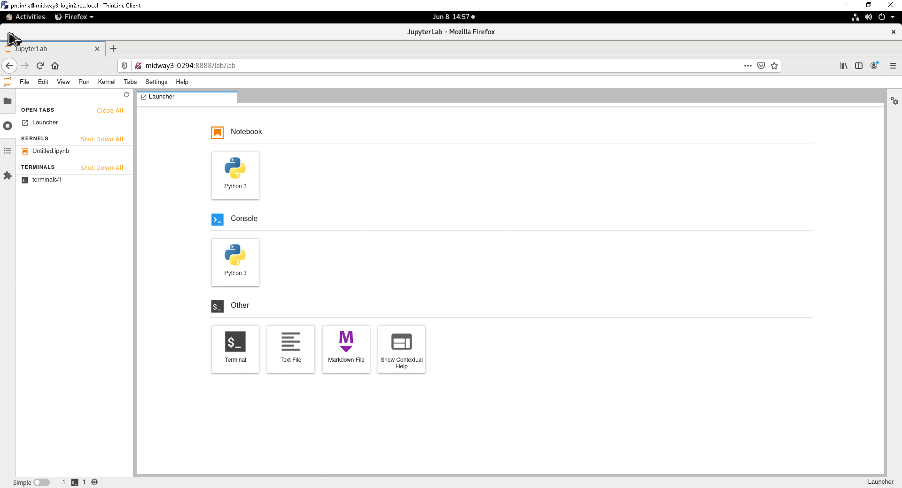

# How to use Singularity on Midway3

Docker is not supported by RCC on the Midway cluster because of security concerns that Singularity addresses. Users who wish to use Docker containers should convert them to Singularity containers. Instructions on how to do this are included below.

Usage `singularity [OPTIONS] run CONTAINERNAME`

## **Basic Instructions**

1. Log into your home directory
2. Create a folder in your home or scratch directory to store the container. For bigger image scratch directory would be advised.
    1. **`mkdir containername`** # Substitute containername with the name of the image
3. Enter that folder (`cd containername`)
4. Then run **singularity pull containername.sif docker://repo/containername:tags**
5. Example: **`singularity pull ubuntu.sif docker://ubuntu:latest`**
6. It pulls a docker container called "ubuntu" from the "default" repository and looks for the "latest" version. The docker container is then converted to a Singularity container.
7. From here, you should be able to run the container by running **`singularity run containername.sif`** where containername.sif is the name of the container created from the "singularity pull ..." command above**.**

### **Instructions for getting docker from private repository:**

Create a Singularity image from a Docker image that is in the NGC container registry requires an authentication or API key. Normally these can be provided by --docker-login command. To create the API key, use this user guide: [NGC Container User Guide for NGC Catalog: NVIDIA GPU Cloud Documentation](https://docs.nvidia.com/ngc/ngc-catalog-user-guide/index.html)

From the login node

```bash
module load singularity
singularity pull --docker-login dli-nlp-nemo.sif docker://nvcr.io/nvidia/dli/dli-nlp-nemo:v3-nemo1.0.1
```

prompted to enter your API Key

The **dli-nlp-nemo** file is located at **/project/rcc/pnsinha/dli-nlp-nemo.sif**

```bash
sinteractive  --account=rcc-staff --partition=gpu  --gres=gpu:1 --mem=16gb
module load singularity
singularity run dli-nlp-nemo.sif
```

As the singularity image is read only, it is desirable to make directories available inside the container

```bash
singularity exec --bind /path/outside/image/:/path/inside/image/ --bind $PWD:/run/user dli-nlp-nemo.sif
```

where
--bind $PWD:/run/user is setting up the working directory to be accessible inside container.



**Opening the Jupyter Lab**

**Option 1**: You can use Thinlinc and open Firefox and navigate to url  `http://<compute-node>:8888/lab/lab`

where <compute-node> is the name of node you have your interactive session is connected.

**Option 2**: Or you can create an ssh tunnel and forward all the traffic of jupyter notebook port to your local machine

`ssh -N -f -L 8888:<compute-node>:8888 cnetID@midway3.rcc.uchicago.edu`

open any browser and navigate to <http://127.0.0.1:8888> or <http://localhost:8888>

### Creating sbatch file for singularity jupyter lab

```bash
#!/bin/bash
#SBATCH --job-name=jupyter_notebook
#SBATCH --time=05:00:00
#SBATCH --output=jupyter_notebook_%j.txt
#SBATCH --error=jupyter_notebook_%j.err
#SBATCH --account=pi-<group>
#SBATCH --partition=gpu  
#SBATCH --gres=gpu:1
#SBATCH --mem=16gb

#assign random port between 8000 and 9000
PORT_NUM=$(shuf -i8000-9000 -n1)
node=$(hostname -s)
user=$(whoami)
cluster="midway3"

#As the singularity image is read only, it is desirable to make directories available inside the container
#/path/outside/image/ is path in your midway3 dir
#/path/inside/image/ is path inside the container

# print tunneling instructions jupyter-log
echo -e "
# Note:# Check jupyter_notebook_%j.err to find the port.

# Command to create SSH tunnel:
ssh -N -f -L $PORT_NUM:${node}:$PORT_NUM ${user}@${cluster}.rcc.uchicago.edu

# Use a browser on your local machine to go to:
http://localhost:$PORT_NUM/
"
module load singularity
singularity exec --bind /path/outside/image/:/path/inside/image/ --bind $PWD:/run/user dli-nlp-nemo.sif jupyter lab --no-browser --ip=${node} --port=$PORT_NUM

# keep it alive
sleep 36000
```

### Troubleshooting

### Troubleshooting Singularity

When using Singularity, you may encounter issues related to temporary file storage, particularly when working with large containers. Below are some common troubleshooting steps to help you resolve these issues effectively.

#### Common Issues

By default, Singularity utilizes the **/tmp** directory on the local machine for temporary files and the **~/.singularity/cache** directory for cache files generated during the build process. If you are working with containers that exceed a few gigabytes in size, you might run into the following error:

```
write /tmp/... : no space left on device
```

This error typically indicates that the **/tmp** directory has filled up on the machine you are using. Additionally, the cache could potentially consume all available space in your HOME directory.

#### Solutions

To resolve these issues, you can override Singularity's default temporary and cache directories by setting specific environment variables before running your Singularity commands. Here’s how to do it:

1. **Create New Directories**: Create a new directory in your scratch space to hold the temporary and cache files:

   ```bash
   mkdir -p /scratch/$USER/singularity/{cache,tmp}
   ```

2. **Set Environment Variables**: Export the following environment variables to redirect the temporary and cache directories:

   ```bash
   export SINGULARITY_CACHEDIR="/scratch/$USER/singularity/cache"
   export SINGULARITY_TMPDIR="/scratch/$USER/singularity/tmp"
   ```

   - **SINGULARITY_CACHEDIR**: This is the directory where Singularity will download and cache files.
   - **SINGULARITY_TMPDIR**: This is the directory where Singularity will write temporary files, including during the building of (squashfs) images.

3. **Cleanup**: After successfully building your container, you can delete everything in the **tmp** and **cache** directories to free up space.

On Midway3, `$SCRATCH/$USER` refers to `/scratch/midway3/<cnetid>`.

#### Additional Tips

- If you continue to experience issues, consider testing with a sandbox build. This can help determine if the problem is related to temporary storage space. You can build a sandbox using the following command:

   ```bash
   sudo singularity build --sandbox [sandbox_name] Singularity
   ```

- If you are still encountering problems, you may want to specify a sanitized home directory using the `-H` option when executing your container. For example:

   ```bash
   rm -rf /tmp/homie && mkdir -p /tmp/homie && singularity exec -H /tmp/homie analysis.img /bin/bash
   ```

This approach can help mitigate issues related to software modules installed in your HOME directory.

By following these steps, you should be able to effectively troubleshoot and resolve issues related to temporary file storage in Singularity.

**References:**

* <https://catalog.ngc.nvidia.com/orgs/nvidia/teams/dli/containers/dli-nlp-nemo>
* <https://www.hpcwire.com/2017/05/04/singularity-hpc-container-technology-moves-lab/>
* <https://github.com/apptainer/singularity>
* <https://apptainer.org/>

For any additional question please email <help@rcc.uchicago.edu>
